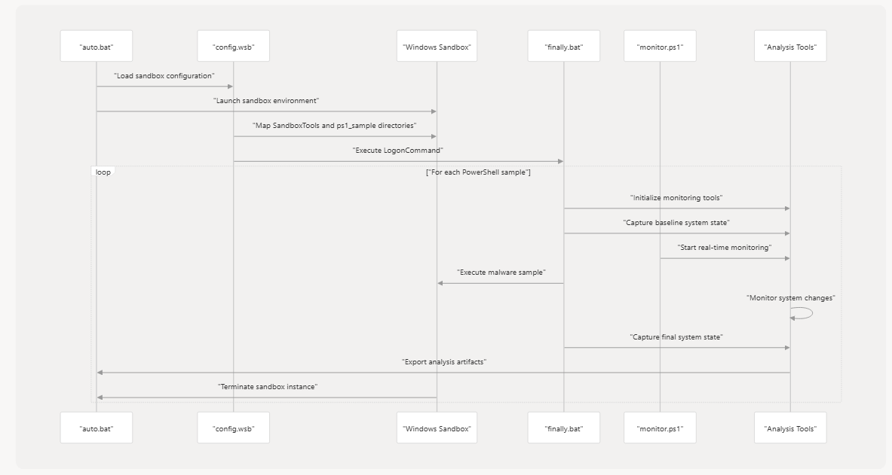

# Windows Sandbox Automation Framework for Fileless Threats

## Contents
- [1.1 Environment & Requirements](#11-environment--requirements)
- [1.2 Installation & Folder Structure](#12-installation--folder-structure)
- [1.3 Execution Flow](#13-execution-flow)
- [Notes](#notes)
- [Demo Video](#demo-video)

---

## 1.1 Environment & Requirements

### Operating System
- Windows 10/11 (with Windows Sandbox feature enabled)

### Software
- Windows Sandbox
- PowerShell
- Sysmon
- Procmon (Process Monitor)
- Python (optional for post-analysis)

### Hardware
- Disk space: > 50GB
- RAM: ≥ 8GB

### Dataset
- ~1000 `.ps1` PowerShell malware samples in `ps1_sample/`

---

## 1.2 Installation & Folder Structure

```
sandbox-project/
│
├── ps1_sample/                # Folder containing all .ps1 malware samples
├── SandboxTools/              # Tools/scripts copied into the sandbox
│   ├── monitor.ps1            # Executes sample and collects logs
│   ├── finally.bat            # Installs Sysmon, starts monitor, shuts down sandbox
│   └── *.exe / Sysmon tools   # Includes Sysmon, Procmon, config files
│
├── auto.bat                   # Runs each sample sequentially via Sandbox
├── finally.wsb               # Windows Sandbox config (maps host folder)
├── active_payload.txt         # Stores the current sample name being tested
```

> Ensure that `finally.wsb` correctly maps `SandboxTools` and `ps1_sample` to the sandbox Desktop.

---

## 1.3 Execution Flow




### Step-by-Step Process

#### 🔁 `auto.bat` – Orchestrator (host)
- Loops through all `.ps1` files in `ps1_sample/`
- For each sample:
  - Copies it to `malware_test.ps1` (sandbox will always execute this fixed name)
  - Updates `active_payload.txt` with the current sample name
  - Launches `finally.wsb` to start sandbox
  - Waits ~6 minutes for sandbox to complete and close

```bat
:: Sample from auto.bat
for %%f in (ps1_sample\*.ps1) do (
    copy "%%f" "SandboxTools\malware_test.ps1" /Y
    echo %%~nxf > active_payload.txt
    start /wait finally.wsb
)
```

####  Inside Sandbox – `finally.bat`
- Installs Sysmon (if not present)
- Launches `monitor.ps1`:
  - Executes `malware_test.ps1`
  - Starts Procmon to capture runtime behavior
  - Dumps spawned processes
  - Compares registry snapshot (before/after)
- After 6 minutes, sandbox auto-shutdown

####  `monitor.ps1`
- Logs collected:
  - `registry_diff.txt`
  - `procmon_log.PML`
  - Process dumps (e.g. encoded commands)
- Results saved in a mounted folder accessible from host after VM closes

---

## Notes

- Each sample runs in isolation for approx. **6 minutes**
- Logs are preserved per sample with the original name from `active_payload.txt`
- You can extend this pipeline with:
  - MongoDB/PostgreSQL storage
  - YARA scanning
  - Post-analysis scripts

---

## Demo Video

[](https://www.youtube.com/watch?v=MyNGjmM5i_o)
